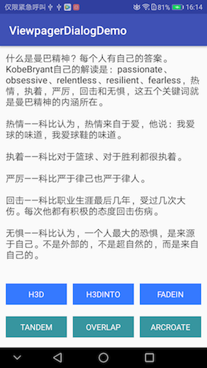
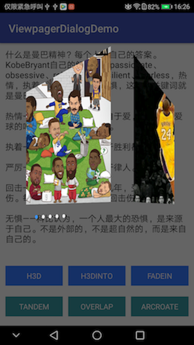
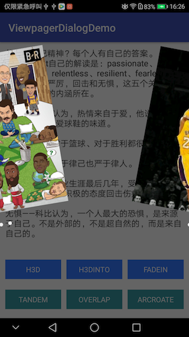

# DialogViewpagerDemo
自定义dialog，嵌套viewpager，实现图片切换及多种相关动画，如：外侧3D旋转、内侧3D旋转、渐变、缩放、重叠、扇形旋转。

###效果图





###部分实现

```
 public static ViewPager.PageTransformer getMyTransformer(TransType type, float maxValue) {
        ViewPager.PageTransformer transformer = null;
        switch (type) {
            case H3D://外侧3D旋转
                transformer = new PageTransformer3D(maxValue);
                break;
            case H3DINTO://内侧3D旋转
                transformer = new PageTransformer3DInTo(maxValue);
                break;
            case FADEIN://渐变
                transformer = new PageTransformerFadeIn(maxValue);
                break;
            case TANDEM://缩放
                transformer = new PageTransformerTandem(maxValue);
                break;
            case OVERLAP://重叠效果
                transformer = new PageTransformerOverlap(maxValue);
                break;
            case ARCROATE://扇形旋转
                transformer = new PageTransformerArcRoate();
                break;

        }
        return transformer;
    }
    
   ```
