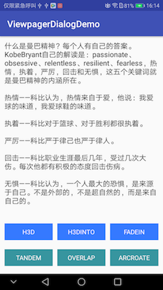

# DialogViewpagerDemo
自定义dialog，嵌套viewpager，实现图片切换及多种相关动画，如：外侧3D旋转、内侧3D旋转、渐变、缩放、重叠、扇形旋转。

###效果图




###部分实现
  * viewpager 填充
  
```
for (int i = 0; i < images.length; i++) {
            final int j = i;
            ImageView[] mDots = new ImageView[images.length];
            int dp1 = (int) TypedValue.applyDimension(TypedValue.COMPLEX_UNIT_DIP, 7, getContext
                    ().getResources().getDisplayMetrics());
            int dp2 = (int) TypedValue.applyDimension(TypedValue.COMPLEX_UNIT_DIP, 5, getContext
                    ().getResources().getDisplayMetrics());
            LinearLayout.LayoutParams params = new LinearLayout.LayoutParams(dp1, dp1);
            
            View parent = LayoutInflater.from(getContext()).inflate(R.layout.item_pager, null);
            ImageView imageView =  parent.findViewById(R.id.imageView);
            LinearLayout dotsLayout =  parent.findViewById(R.id.dots_layout);
            Glide.with(getContext()).load(images[i]).into(imageView);
            imageView.setOnClickListener(new View.OnClickListener() {
                @Override
                public void onClick(View v) {
                    dismiss();
                }
            });


            if (images.length > 0 && images.length != 1) {
                for (int k = 0; k < images.length; k++) {
                    mDots[k] = new ImageView(getContext());
                    mDots[k].setBackgroundResource(R.drawable.dialog_dots_layout);
                    params.leftMargin = dp2;
                    params.rightMargin = dp2;
                    if (k == i) {
                        mDots[k].setSelected(true);
                    } else {
                        mDots[k].setSelected(false);
                    }
                    mDots[k].setLayoutParams(params);
                    dotsLayout.addView(mDots[k], k);
                }
            }
            views.add(parent);
        }
```

 * 图片切换的动画
 
 
 ```
 public static ViewPager.PageTransformer getMyTransformer(TransType type, float maxValue) {
        ViewPager.PageTransformer transformer = null;
        switch (type) {
            case H3D://外侧3D旋转
                transformer = new PageTransformer3D(maxValue);
                break;
            case H3DINTO://内侧3D旋转
                transformer = new PageTransformer3DInTo(maxValue);
                break;
            case FADEIN://渐变
                transformer = new PageTransformerFadeIn(maxValue);
                break;
            case TANDEM://缩放
                transformer = new PageTransformerTandem(maxValue);
                break;
            case OVERLAP://重叠效果
                transformer = new PageTransformerOverlap(maxValue);
                break;
            case ARCROATE://扇形旋转
                transformer = new PageTransformerArcRoate();
                break;

        }
        return transformer;
    }
    
   ```
   
 如果对你有那么一丝的帮助，请不要吝啬。求star！

 If you like this library's design, feel it help to you, you can point the upper right corner "Star" support Thank you! ^ _ ^
